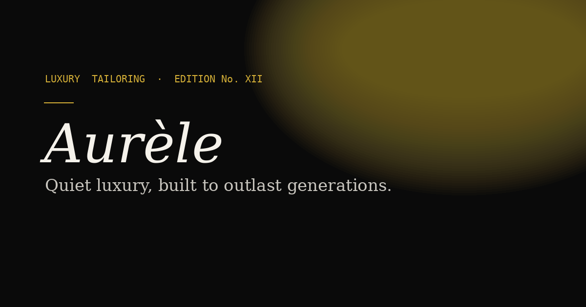

# Aurèle — Luxury E-Commerce Template

A dark, editorial-style e-commerce template for fashion, jewelry, and other premium goods brands. Built with plain HTML/CSS/JS (no framework lock-in), a real Stripe checkout, and a no-code content manager so non-technical store owners can run the whole site themselves.



## What's included

- **5 page templates**: Home, Category, Product, Order Confirmed, Order Cancelled
- **4 legal pages**: Shipping, Returns, Privacy Policy, Terms of Service — pre-written, ready to customize
- **Real Stripe Checkout** — server-verified pricing (never trusts the browser for amounts), works on Cloudflare Pages out of the box
- **No-code CMS** (Decap CMS + DecapBridge) — manage products, categories, photos, site colors, fonts, logo, and homepage text without touching code
- **5 pre-built color themes** + 4 heading fonts + 4 body fonts, swappable from the CMS
- **Fully responsive**, mobile-first layout
- **Loading, empty, and error states** on every data-driven page
- **Accessible**: keyboard-navigable, skip-to-content link, visible focus states, screen-reader labels on icon buttons
- **SEO-ready**: meta descriptions, Open Graph tags, semantic HTML, sitemap

## Tech stack

Plain HTML, CSS, and vanilla JavaScript. No build step, no npm install, no framework required to run it. The one dynamic piece — Stripe checkout — runs as a Cloudflare Pages Function written with zero dependencies (talks to Stripe's REST API directly via `fetch`).

This means:
- You can open `index.html` directly in a browser to preview the design
- Deploying is "connect a Git repo to Cloudflare Pages," nothing more
- No dependency updates to maintain, no framework version to keep current

## Quick start

See **[docs/INSTALLATION.md](docs/INSTALLATION.md)** for the full walkthrough — most people are live in under 10 minutes.

## Customizing for your brand

See **[docs/CUSTOMIZATION.md](docs/CUSTOMIZATION.md)** — covers renaming the brand, changing colors/fonts, adding products and categories, and editing every page's text, all from the CMS with no code editing required.

## Questions

See **[docs/FAQ.md](docs/FAQ.md)** for common questions, or **[CHANGELOG.md](CHANGELOG.md)** for version history.

## License

See **[LICENSE](LICENSE)**.

## Folder structure

```
├── index.html              Home page
├── category.html           Category listing page (reads ?cat=)
├── product.html            Product detail page (reads ?id=)
├── success.html / cancel.html   Post-checkout pages
├── shipping.html, returns.html, privacy.html, terms.html   Legal pages
├── admin/                  CMS admin panel
│   ├── index.html
│   └── config.yml          CMS field definitions — this is the file to edit
│                            if you add new content types
├── assets/
│   ├── site.js              Cart logic, category nav, shared helpers
│   └── theme.js              Applies CMS-selected colors/fonts/logo/text
├── functions/api/
│   └── create-checkout-session.js   Stripe checkout (Cloudflare Pages Function)
├── images/                  Favicon, social preview, uploaded product photos
├── *.json                  Your content: products, categories, theme, site text
└── docs/                    Full documentation
```
